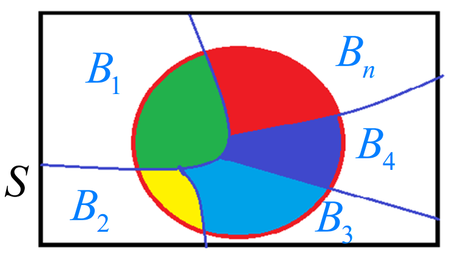

# 基本概念

## 随机事件

- 必然事件的概率不一定为1
- 不可能事件的概率不一定为0

## 随机事件的运算

### 和事件

$\{x|x \in A \ or \ x \in B\}$为A和B的和事件，记作$A \cup B$或$A+B$

### 积事件

$\{x|x \in A \ and \ x \in B\}$为A和B的积事件，记作$A \cap B$或$AB$

### 差事件

$\{x|x \in A \ and \ x \notin B\}$为A和B的和事件，记作$A \cup B$或$A+B$

## 简单概型

### 古典概型

若一个样本空间$\Omega$包含有限的样本点，**且每个样本点发生的概率相同**，其中事件A包含的样本点记为$A$。那么A发生的概率为$$P(A) = \frac{N_A}{N_B}$$

### 几何概型

若一个样本空间$\Omega$是几何空间中的一个有限区域，**且空间内的概率是均匀的**，其中事件A包含的空间记为$A$。那么A发生的概率为$$P(A) = \frac{M_A}{M_B}$$
其中M样本空间的度量，取决于样本空间的维数

### 伯努利概型

- 伯努利实验：一个实验只有两种结果$A$或$\bar{A}$，那么这个实验称为伯努利实验
在伯努利实验中将实验重复$n$次，那么实验称为$n$重伯努利实验。其中事件$A$发生$k$次的概率为$$C_n^kp^k(1-p)^{n-k}, k=0,1,\dots,n$$

## 条件概率与独立性

条件概率：$P(B|A) = \frac{P(AB}{P(A)}$
逆事件的概率：$P(\bar{B}|A) = 1-P(B|A)$

独立性的定义：
$$
\begin{cases}
 P(A_iA_j) = P(A_i)P(A_j) \\
 P(A_iA_jA_k) = P(A_i)P(A_j)P(A_k) \\
 \dots \\
 P(A_1A_2\dots A_n) = P(A_1)P(A_2)\dots P(A_n) \\
\end{cases}
$$

## 五大公式

### 加法公式

和容差公式相同$$P(A\cup B) = P(A)+P(B)-P(AB)$$

### 减法公式

$$P(A-B) = P(A\bar{B}) = P(A)-P(AB)$$

### 乘法公式

$$P(AB) = P(A)P(B|A) = P(B)P(A|B)$$
$$P(A_1A_2\dots A_n) = P(A_n|A_1A_2\dots A_{n-1})P(A_{n-1}|A_1A_2\dots A_{n-2})\dots P(A_2|A_1)P(A_1)$$

### 全概率公式

相当于将整个样本空间划分为若干部分，B发生的概率即每个小块中B发生的概率之和

$$P(B) = \sum^n_{k=1}P(B|A_k)P(A_k)$$

### 贝叶斯公式

贝叶斯公司即逆全概率公式，即在A已经发生的情况下，A中分割的小事件$B_i$在A**已经发生**的条件下的概率。
$$P(A_i|B)=\frac{P(A_i)P(B|A_i)}{P(B)}$$
$$P(A_i|B)=\frac{P(A_i)P(B|A_i)}{\sum^n_{k=1}P(A_k)P(B|A_k)}, i=1,2,\dots ,n$$
其中$B_i$被视为$A$发生的原因，而$P(B_i)$表示原因发生的可能性的大小，即**先验概率**。
而$P(B_i|A)$反映了产生了结果A之后，对于各个概率的认识，称**后验概率**

在条件概率中：$P(A_i|B) = \frac{P(A_iB)}{P(B)}$
$P(A_iB) = P(A_i)P(B|A_i)$
$P(B)=\sum^n_{k=1}P(B|A_k)P(A_k)$
